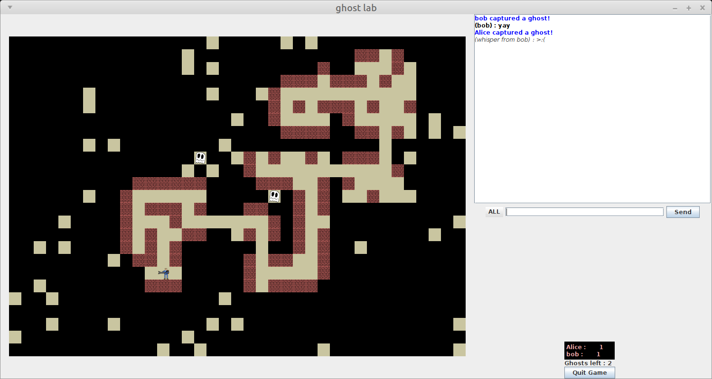

## Little C program

Projet personnel fait en C avec la librairie SDL. Ce programme est une série de mini-jeux, et me permet de me faire la main sur les techniques qui aboutissent à un moteur 2D optimisé et multi-plateforme.
Il contient pour le moment un Jeu de la Vie (Conway's game of life), et une petite simulation de vaisseau spacial.

[code source](https://github.com/paul-gangneux/little-c-program)

<video width="720" height="480" controls loop autoplay muted>
  <source src="vids/gameoflife.mp4" type="video/mp4">
  Your browser does not support the video tag.
</video>

<video width="720" height="480" controls loop autoplay muted>
  <source src="vids/space.mp4" type="video/mp4">
  Your browser does not support the video tag.
</video> 

## Ghostlab

Projet scolaire de 3eme année de licence, ghostlab est un petit jeu multijoueur en ligne avec un serveur codé en C et un client codé en Java. Le but de ce projet était de créer des programmes qui manipulent directement les protocoles réseaux (TCP, UDP, Multicast), avec multi-threading (bonne gestion des mutexes et variables partagées), resistant aux erreurs (pas de bug ou fuite de mémoire en cas de déconnexion imprévue), et pouvant communiquer ensemble, ou avec tout autre programme respectant le protocole.

Le projet a été fait en groupe. Je me suis personnellement occupé de coder tout le serveur, de gérer en partie la structure globale du projet (dont les scripts de compilation), et ai aidé pour coder la partie communication réseau du client.

[code source](https://github.com/paul-gangneux/ghostlab)

## FractalMaker

Projet scolaire de 3eme année de licence, FractalMaker est un generateur de fractales fait en Java, utilisant les ensembles de Julia et de Mandelbrot. Le but de ce projet est d'utiliser au mieux le paradigme de programmation orientée objet, en utilisant beaucoup d'expressions lambdas pour passer des fonctions en paramètres d'autres fonctions. La génération de fractales est hautement paramétrable, on peut modifier le taux d'anti-crénelage, entrer à la main la fonction complexe utilisée pour le calcul de la fractale, choisir la fonction utilisée pour l'affichage (couleur, luminosité), etc.

Le projet a été fait en groupe. Je me suis personnellement occupé tout ce qui permet de générer la fractale à partir d'une fonction complexe, de l'interface graphique, des fonctions complexes, et de la structure globale du projet.

[code source](https://github.com/paul-gangneux/fractal-generator-java)

